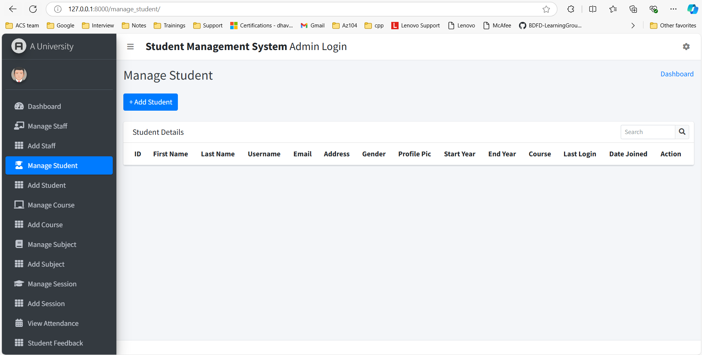

# Student Management System Project
The Student Management System project is a comprehensive web application built using Django, designed to facilitate efficient management of students, staff, and academic operations for educational institutions. It provides a robust admin dashboard and user-friendly interfaces for both students and staff, enabling seamless management and tracking of academic activities.

## Features of this Project 

### A. Admin Users Can
1. See Overall Summary Charts of Stuudents Performance, Staffs Perfomrances, Courses, Subjects, Leave, etc.
2. Manage Staffs (Add, Update and Delete)
3. Manage Students (Add, Update and Delete)
4. Manage Course (Add, Update and Delete)
5. Manage Subjects (Add, Update and Delete)
6. Manage Sessions (Add, Update and Delete)
7. View Student Attendance
8. Review and Reply Student/Staff Feedback
9. Review (Approve/Reject) Student/Staff Leave

### B. Students Can
1. See the Overall Summary Charts related to their attendance, their subjects, leave status, etc.
2. View Attendance
3. View Result
4. Apply for Leave
5. Send Feedback to HOD

## How to Install and Run this project?

### Pre-Requisites:
1. Install Git Version Control
[ ]

2. Install Python Latest Version
[ https://www.python.org/downloads/ ]

3. Install Pip (Package Manager)
[ https://pip.pypa.io/en/stable/installing/ ]


### Installation
**1. Create a Folder where you want to save the project**

**2. Create a Virtual Environment and Activate**

Install Virtual Environment First
```
pip install virtualenv
```

Create Virtual Environment

For Windows
```
python -m venv venv
```
For Mac
```
python3 -m venv venv
```

Activate Virtual Environment

For Windows
```
source venv/scripts/activate
```

For Mac
```
source venv/bin/activate
```

**3. Clone this project**
```
git clone git_project_link
```

Then, Enter the project
```
cd Student_Management_System
```

**4. Install Requirements from 'requirements.txt'**
```python
pip install -r requirements.txt
```

**5. Add the hosts**

- Got to settings.py file 
- Then, On allowed hosts, Add [‘*’]. 
```python
ALLOWED_HOSTS = ['*']
```
*No need to change on Mac.*


**6. Now Run Server**

Command for PC:
```python
python manage.py runserver
```

Command for Mac:
```python
python3 manage.py runserver
```

**7. Login Credentials**

Create Super User (HOD)
```
python manage.py createsuperuser
```
Then Add Email, Username and Password

**or Use Default Credentials**

*For Admin*
Email: admin@gmail.com
Password: admin

*For Student*
Email: student@gmail.com
Password: student

### Student Management System Admin Login 
#### Dashboard

#### Add Staff 

#### Manage Student
